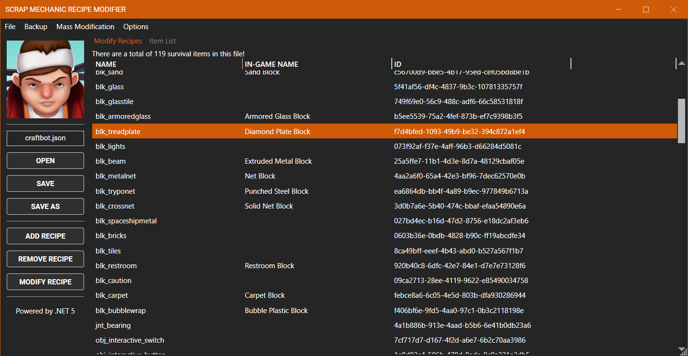
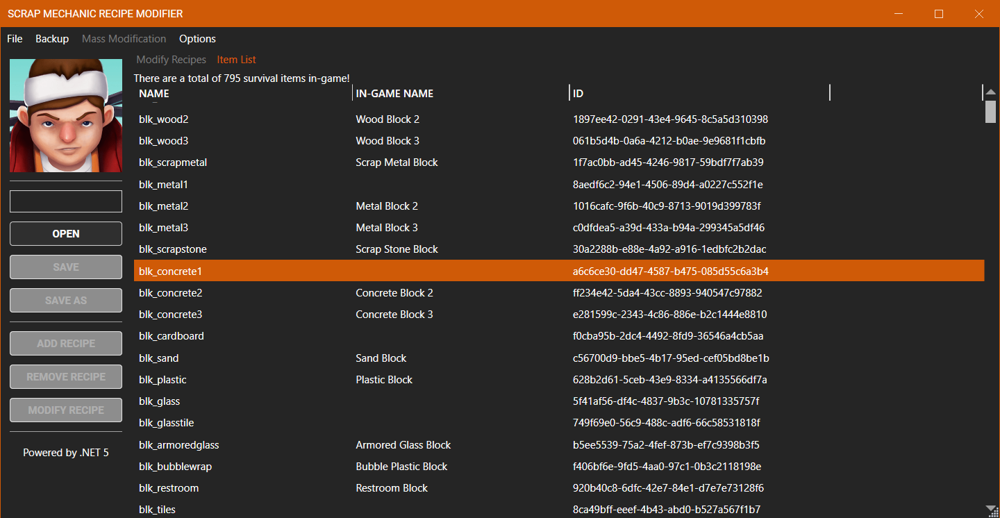
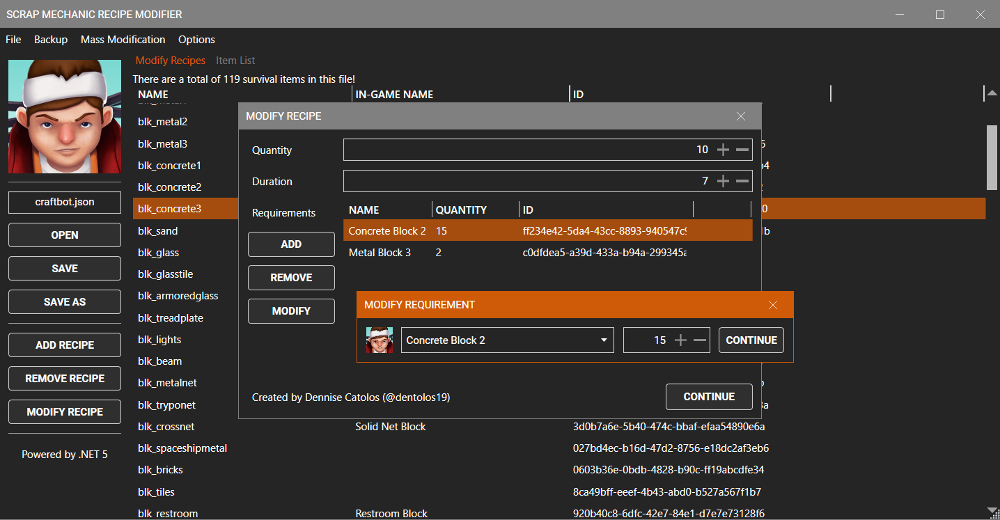
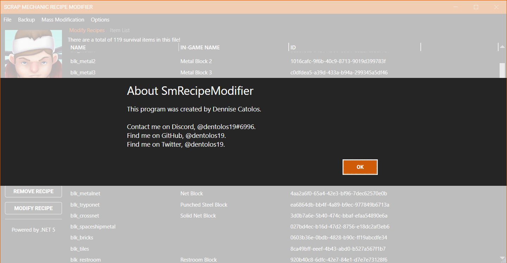

#  Recipe Mechanic

A powerful and easy-to-use recipe tool for Scrap Mechanic!

> This project is currently being reworked! Do not clone or build as it is incomplete!

## Features

* [X] Supports most of the in-game recipes
  * [X] Supports Cookbot recipes
  * [X] Supports Craftbot recipes
  * [X] Supports Dispenser recipes
  * [X] Supports Workbench recipes
  * [X] Supports Trader deals
* [X] Contains many powerful tools
  * [X] Has the ability to add any kinds of recipes
  * [X] Has the ability to remove any kind of recipes
  * [X] Has the ability to edit individual recipes
  * [X] Has the ability to edit individual ingredients of a recipe
* [X] Simplistic user interface for easy use

## Screenshots

