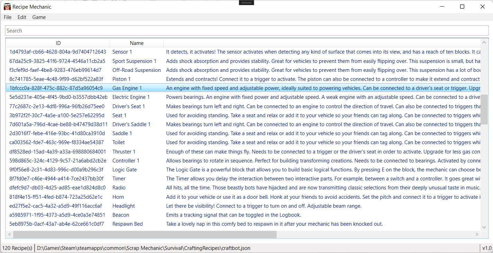
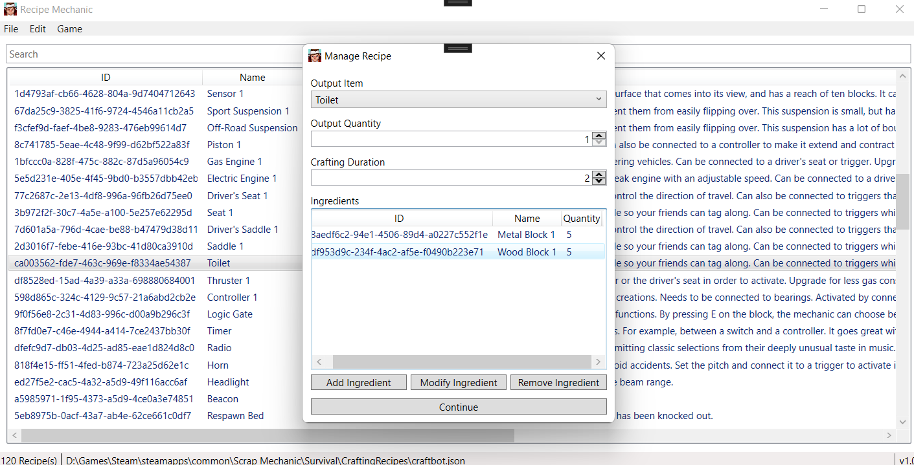
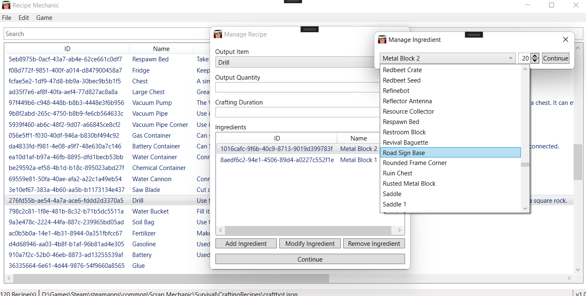

#  Recipe Mechanic

A powerful and easy-to-use recipe tool for Scrap Mechanic!

## ⚒️ Usage

1. Download the latest package from the [releases page](https://github.com/dentolos19/RecipeMechanic/releases)
2. Extract the package and run `RecipeMechanic.exe`
3. Done!

> **Note**: It is recommended to backup the game first before editing recipe files.

## ⚙️ Features

- [x] Supports most of the in-game recipes
  - [x] Supports Cookbot recipes
  - [x] Supports Craftbot recipes
  - [x] Supports Dispenser recipes
  - [x] Supports Workbench recipes
  - [x] Supports Trader deals
- [x] Contains many tools for easy management
  - [x] Allows to add any kind of recipes
  - [x] Allows to remove any kind of recipes
  - [x] Allows to edit individual recipe data
    - [x] Supports editing the output quantity
    - [x] Supports editing the crafting duration
    - [x] Supports editing the required ingredients
  - [x] Has the ability to edit many recipes all at once
- [x] Simplistic user interface for easy use
- [x] Allows the users to see all in-game items

## 📸 Screenshots

